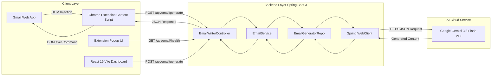

# 📧 AI-Powered Email Reply Assistant & Generator

[](https://www.oracle.com/java/)
[](https://spring.io/projects/spring-boot)
[](https://ai.google.dev/)
[](https://developer.chrome.com/docs/extensions/)
[](https://react.dev/)
[](LICENSE)

An end-to-end, enterprise-grade AI email productivity suite consisting of:
1. **Spring Boot 3 REST API** powered by **Google Gemini 3.8 Flash** via reactive non-blocking `WebClient`.
2. **Gmail Chrome Extension (Manifest V3)** that natively injects an **AI Reply** action button and tone selector directly into Gmail's compose interface.
3. **Modern React Web Dashboard** for standalone generation, testing, and customization.

---

## 📑 Table of Contents
- [Architecture & System Design](#-architecture--system-design)
- [Tech Stack](#-tech-stack)
- [Key Features](#-key-features)
- [Directory Structure](#-directory-structure)
- [Technical Challenges & Engineering Solutions](#-technical-challenges--engineering-solutions)
- [Step-by-Step Setup Guide](#-step-by-step-setup-guide)
- [API Documentation](#-api-documentation)
- [🎯 Comprehensive Interview Preparation Guide](#-comprehensive-interview-preparation-guide)

---

## 🏛 Architecture & System Design



### Flow Breakdown
1. **Detection**: A `MutationObserver` in the Chrome extension detects when the user opens or replies to an email thread in Gmail.
2. **Context Extraction**: The content script intelligently traverses the active DOM thread, extracts the original email body while filtering out compose noise and signatures.
3. **Tone Customization**: The user selects a desired tone (`Professional`, `Casual`, `Friendly`, `Concise`, `Formal`, `Urgent`).
4. **Backend Processing**: A JSON payload is dispatched to the Spring Boot REST endpoint (`/api/email/generate`).
5. **Prompt Engineering & AI Inference**: The backend formats a strict, zero-shot system prompt prohibiting extraneous subject lines or conversational filler, and queries Google Gemini 3.8 Flash asynchronously via `WebClient`.
6. **Live Injection**: The sanitized reply is received and inserted directly into Gmail's content-editable textbox using native event dispatching so Gmail's auto-save registers the draft.

---

## 💻 Tech Stack

### Backend
- **Language**: Java 17 LTS
- **Framework**: Spring Boot 3.5.4
- **Reactive Networking**: Spring WebFlux (`WebClient`) for asynchronous, high-throughput outbound HTTP requests
- **AI Engine**: Google Gemini API (`gemini-3.8-flash`)
- **JSON Processing**: Jackson (`ObjectMapper`, `JsonNode`)
- **Build Tool**: Apache Maven (via `mvnw` wrapper)

### Chrome Extension
- **Platform**: Google Chrome Extensions API (Manifest V3)
- **DOM Observers**: JavaScript `MutationObserver` with debouncing
- **State Management**: `chrome.storage.local`
- **UI & Styling**: Vanilla CSS3, Google Sans typography, custom SVG micro-animations, floating toast system

### Frontend Dashboard
- **Framework**: React 19 + Vite
- **UI Components**: Material UI (MUI v7) & Emotion
- **HTTP Client**: Axios

---

## ✨ Key Features

- **Native Gmail Integration**: Blends seamlessly into Gmail's UI without disrupting keyboard shortcuts, send buttons, or existing extensions.
- **Strict Anti-Duplicate Mechanism**: Uniquely binds to the primary Send button container in Gmail, preventing duplicate button injection across nested DOM layers.
- **Multiple Tone Profiles**: Choose between *Professional*, *Casual*, *Friendly*, *Concise*, *Formal*, and *Urgent* replies.
- **Thread Context Extraction**: Automatically parses message bodies from long email threads to provide deep conversational context to the LLM.
- **Non-Blocking Asynchronous Backend**: Employs Spring WebFlux `WebClient` rather than legacy blocking `RestTemplate`, enabling high concurrency and minimal thread starvation.
- **Resilient Fallback & Error Handling**: Gracefully handles network timeouts, quota limits, and missing configurations through custom status endpoints and user-friendly toast alerts.
- **Configuration Flexibility**: Automatically reads Gemini credentials from system environment variables (`GEMINI_API_KEY`) or local properties.

---

## 📂 Directory Structure

```plaintext
EmailReplyGenerator/
├── Backend/
│   └── email-writer-3/
│       ├── src/
│       │   ├── main/
│       │   │   ├── java/com/email/writer/
│       │   │   │   ├── controller/
│       │   │   │   │   └── EmailWriterController.java   # REST Controller & validation
│       │   │   │   ├── model/
│       │   │   │   │   └── EmailRequest.java            # DTO payload model
│       │   │   │   ├── repository/
│       │   │   │   │   ├── EmailGenratorRepo.java       # Repository interface
│       │   │   │   │   └── EmailGenratorRepoImpl.java   # Gemini API integration & prompt engineering
│       │   │   │   ├── service/
│       │   │   │   │   ├── EmailService.java            # Service contract
│       │   │   │   │   └── EmailServiceImpl.java        # Business logic layer
│       │   │   │   └── EmailWriter3Application.java     # Spring Boot main entrypoint
│       │   │   └── resources/
│       │   │       └── application.properties           # Server & model config
│       │   └── test/                                    # Unit & integration tests
│       ├── pom.xml                                      # Maven project dependencies
│       └── mvnw.cmd                                     # Cross-platform Maven wrapper
│
├── Email_reply_ext/                                     # Manifest V3 Chrome Extension
│   ├── manifest.json                                    # Extension manifest
│   ├── content.js                                       # Gmail DOM injection & thread extractor
│   ├── content.css                                      # Gmail native UI styles & floating toast
│   ├── popup.html                                       # Extension status popup interface
│   ├── popup.js                                         # Connectivity checker & preferences
│   ├── popup.css                                        # Popup modern styling
│   └── icons/                                           # 16px, 48px, 128px PNG icons
│
├── Frontend/
│   └── email-writer-react/                              # React + Vite standalone web UI
│       ├── src/
│       │   ├── App.jsx                                  # Main generation dashboard
│       │   └── main.jsx
│       └── package.json
│
├── .gitignore                                           # Clean Git tracking filters
└── README.md                                            # Project documentation & interview guide
```

---

## 🔧 Technical Challenges & Engineering Solutions

| Challenge | Problem | Engineering Solution |
| :--- | :--- | :--- |
| **Nested DOM Duplication in Gmail** | Gmail's compose bar uses deeply nested layout wrappers (`.btC`, `.aDh`, `.gU`). Querying standard toolbar classes resulted in the AI button being rendered 3 times. | Anchored injection strictly to the unique primary **Send button** container (`.dC`) and instituted a container-level guard check (`composeContainer.querySelector('.ai-reply-wrapper')`) to guarantee exact 1-to-1 injection. |
| **Model Deprecation & Evolution** | Legacy endpoints (`gemini-2.0-flash`) were retired by Google, producing HTTP 404 responses. | Refactored the repository configuration to dynamically communicate with `gemini-3.8-flash` with full model metadata discovery. |
| **Thread Context Extraction** | Replying to multi-turn email threads often caused replies to reference the wrong message or capture compose draft text. | Implemented reverse thread parsing prioritizing `.adn.ads`, `.h7`, and `.a3s.aiL` containers while explicitly excluding the active compose container. |
| **Asynchronous Spring Concurrency** | Synchronous REST clients create thread bottlenecks under load. | Built the repository using Spring Boot's reactive `WebClient`, supporting clean non-blocking outbound requests and robust error stream parsing. |
| **Security & Secret Leakage** | Committing raw API tokens to source control causes automatic token revocation by secret scanners. | Configured Spring parameter interpolation `${GEMINI_API_KEY:}` with environment variable fallback and root `.gitignore` sanitization. |

---

## 🚀 Step-by-Step Setup Guide

### 1. Prerequisites
- **Java Development Kit (JDK 17 LTS)**
- **Google Chrome Browser**
- **Gemini API Key** (Free from [Google AI Studio](https://aistudio.google.com/app/apikey))
- **Node.js 18+** *(Optional, only if running the React frontend)*

---

### 2. Configure & Start the Backend

1. **Set your Gemini API Key**:
   In PowerShell:
   ```powershell
   $env:GEMINI_API_KEY="your_gemini_api_key_here"
   ```
   *Or set it directly in `Backend/email-writer-3/src/main/resources/application.properties`:*
   ```properties
   gemini.api.key=your_gemini_api_key_here
   ```

2. **Run the Spring Boot Application**:
   ```powershell
   cd D:\Project\EmailReplyGenertor\Backend\email-writer-3
   .\mvnw.cmd spring-boot:run
   ```
   *Or run the pre-built JAR directly:*
   ```powershell
   java -jar target\email-writer-0.0.1-SNAPSHOT.jar
   ```

3. **Verify Server Health**:
   Visit [http://localhost:8080/api/email/health](http://localhost:8080/api/email/health) in your browser:
   ```json
   {"status":"UP","message":"Email Writer Backend is running successfully!"}
   ```

---

### 3. Load the Chrome Extension into Google Chrome

1. Open **Google Chrome** and navigate to `chrome://extensions/`.
2. In the top-right corner, enable **Developer mode**.
3. Click **Load unpacked** (top-left).
4. Select the directory:
   ```plaintext
   D:\Project\EmailReplyGenertor\Email_reply_ext
   ```
5. Open [Gmail](https://mail.google.com), open any email, and click **Reply**.
6. The **✨ AI Reply** button and Tone selector will appear next to the Send button!

---

### 4. (Optional) Run the React Web Dashboard

```powershell
cd D:\Project\EmailReplyGenertor\Frontend\email-writer-react
npm install
npm run dev
```
Open [http://localhost:5173](http://localhost:5173) in your browser.

---

## 📡 API Documentation

### 1. Health Check
- **Endpoint**: `GET /api/email/health`
- **Response**:
  ```json
  {
    "status": "UP",
    "message": "Email Writer Backend is running successfully!"
  }
  ```

### 2. Generate Reply
- **Endpoint**: `POST /api/email/generate` (Alias: `/api/email/genrate`)
- **Headers**: `Content-Type: application/json`
- **Request Body**:
  ```json
  {
    "emailContent": "Hi Sanjay, could we reschedule our meeting to tomorrow 3 PM?",
    "tone": "professional"
  }
  ```
- **Success Response (`200 OK`)**:
  ```text
  Hi,

  Tomorrow at 3:00 PM works perfectly for me. I will send an updated calendar invitation shortly.

  Best regards,
  Sanjay
  ```
- **Validation Error (`400 Bad Request`)**:
  ```text
  Error: Email content cannot be empty. Please provide the email you want to reply to.
  ```

---

## 🎯 Comprehensive Interview Preparation Guide

This section is designed to help you confidently present this project in technical interviews.

### 1. The 60-Second Elevator Pitch
> *"I designed and built an end-to-end AI Email Reply Assistant that integrates directly into Gmail. The architecture consists of a Spring Boot 3 microservice in Java 17 that interfaces with Google's Gemini 3.8 Flash model, paired with a Manifest V3 Chrome Extension. When a user opens any email thread in Gmail, the extension injects a contextual UI next to the Send button, allows the user to choose an appropriate tone—like professional, casual, or concise—extracts the email context from the thread, and generates an accurate, direct email reply without subject lines or filler text. I also built a standalone React dashboard for testing and customization."*

---

### 2. Key Architecture & Design Questions

#### Q: Why did you choose Spring Boot for the backend instead of Python (FastAPI/Flask)?
> **Answer**:
> *"While Python is popular in AI prototyping, Spring Boot is the gold standard for enterprise production systems. By building the backend in Java 17 and Spring Boot 3, I leveraged type safety, enterprise-grade dependency injection, clear layered separation of concerns (Controller-Service-Repository), and Spring WebFlux's non-blocking `WebClient`. This ensures that outbound calls to LLM APIs don't block worker threads, allowing the service to scale efficiently under concurrent workloads."*

#### Q: How does the Chrome extension handle Gmail being a complex Single Page Application (SPA)?
> **Answer**:
> *"Gmail does not perform standard page reloads; conversations and compose windows are dynamically mounted and unmounted in the DOM. To handle this reliably:
> 1. I implemented a `MutationObserver` on `document.body` with a debounced callback that monitors when compose elements appear.
> 2. Instead of querying arbitrary toolbar classes which are nested across multiple DIVs, I anchored the injection directly to Gmail's unique Send button container (`.dC`).
> 3. I implemented container-level guard checks (`composeContainer.querySelector('.ai-reply-wrapper')`) to prevent duplicate buttons from ever being injected across re-renders."*

#### Q: How do you extract the original email content accurately from a multi-email thread?
> **Answer**:
> *"Email threads in Gmail contain previous quotes, headers, and signatures. My content script scans thread container selectors such as `.adn.ads`, `.h7`, and `.a3s.aiL` in reverse chronological order, filtering out the active compose container itself. This guarantees that the assistant reads the message being replied to rather than the user's current draft or older collapsed emails."*

#### Q: How did you design the prompts to ensure good LLM output?
> **Answer**:
> *"A common problem with naive LLM replies is that models output conversational meta-text like 'Here is your reply:' or include a redundant 'Subject:' line. In my repository implementation, I engineered a structured prompt with negative constraints:
> - Explicitly forbidding subject line generation.
> - Mandating direct email body generation ready to send.
> - Injecting dynamic tone instructions based on user selection.
> - Enclosing the original email in clear demarcation delimiters (`\"\"\"`) to prevent prompt injection or hallucination."*

---

### 3. Deep-Dive Scenarios: What Obstacles Did You Overcome?

- **Handling API Deprecation**:
  *"During testing, Google updated the model lifecycle, deprecating `gemini-2.0-flash`. I queried the Gemini model discovery API to inspect supported generation methods, identified `gemini-3.8-flash`, and refactored the application properties to support dynamic model switching without altering business logic."*
- **Path Quoting & Cross-Platform Wrapper Fixes**:
  *"On Windows environments where user paths contain whitespace (e.g. `C:\Users\First Last`), standard batch wrappers can fail with unquoted string tokenization errors. I debugged the `mvnw.cmd` startup script, properly quoting execution parameters and error codes to make the project fully portable."*
- **Preventing Secret Exposure**:
  *"I architected the credential management so that secrets are never hardcoded in source control. The Spring properties file utilizes environment variable interpolation (`${GEMINI_API_KEY:}`), paired with a multi-tier `.gitignore` to protect developer secrets."*

---

### 4. Future Enhancements / Scalability Roadmap
If asked *"What would you add next?"*:
1. **RAG (Retrieval-Augmented Generation)**: Ingest past sent emails to mimic the user's personal writing style and signature.
2. **Rate Limiting & Authentication**: Implement Spring Security with JWT tokens and Redis-backed bucket token rate limiting for multi-tenant SaaS deployment.
3. **Multi-LLM Routing**: Fallback mechanism routing between Gemini, Anthropic Claude, and OpenAI depending on latency, cost, and availability.
4. **Draft Auto-Detection**: Sentiment analysis on incoming emails to automatically suggest 'Accept', 'Decline', or 'Request Info' one-click actions.

---

## 📄 License
This project is open-source under the [MIT License](LICENSE).
